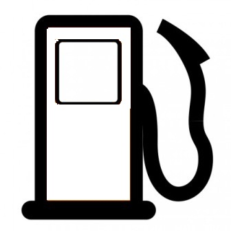
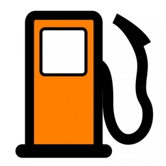
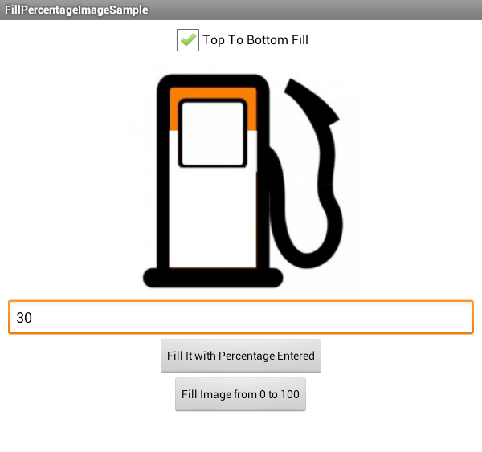
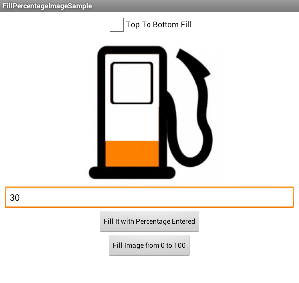

Percentage-wise-Image-Filling
=============================

An Android applicatin which show you demo how to use Color image on Black & White to fill it with `Percentage` 
parameter.

Usage
-------

You need to have two images before implementing this demo. You can use following image which i have used in application.

 

As you can see in the following image that, input parameter has `30` value. When you press `Fill it with Percentage entered` button, it will fill based on `Top To Bottom Fill` checkbox.

License
-------

    Copyright 2014 Chintan Rathod

    Licensed under the Apache License, Version 2.0 (the "License");
    you may not use this file except in compliance with the License.
    You may obtain a copy of the License at

       http://www.apache.org/licenses/LICENSE-2.0

    Unless required by applicable law or agreed to in writing, software
    distributed under the License is distributed on an "AS IS" BASIS,
    WITHOUT WARRANTIES OR CONDITIONS OF ANY KIND, either express or implied.
    See the License for the specific language governing permissions and
    limitations under the License.
